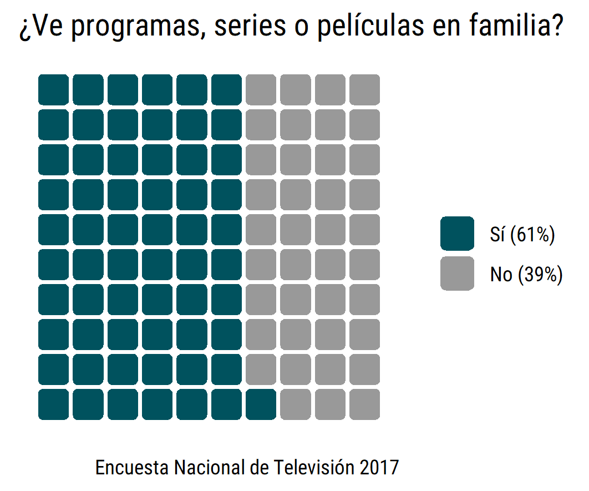

# 30DayChartChallenge2021
Participación en #30DayChartChallenge 2021.

- En la carpeta "R" encuentras los script de los gráficos subidos según día.

- En la carpeta "input" puedes encontrar las bases de datos, a menos que éstas sean públicas. De ser así en el script encontrarás un link a ellas.

- En la carpeta "output" encuentras las imágenes de los gráficos.

Equipo [DESUC](http://sociologia.uc.cl/desuc/quienes-somos-desuc/)

### Día 1: Part to whole 

- Datos para la elaboración del gráfico disponibles en la página web de [CNTV](https://www.cntv.cl/estudios-y-estadisticas/encuesta-nacional-de-television/)
- Código disponible [aquí](/R/01-part_to_whole.R)

