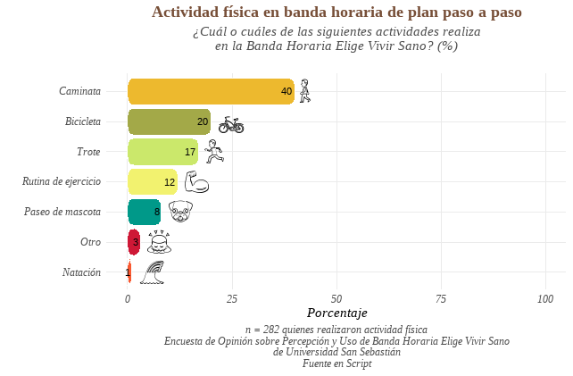
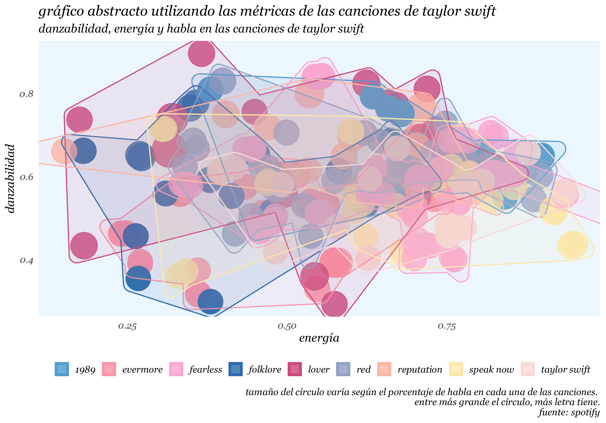
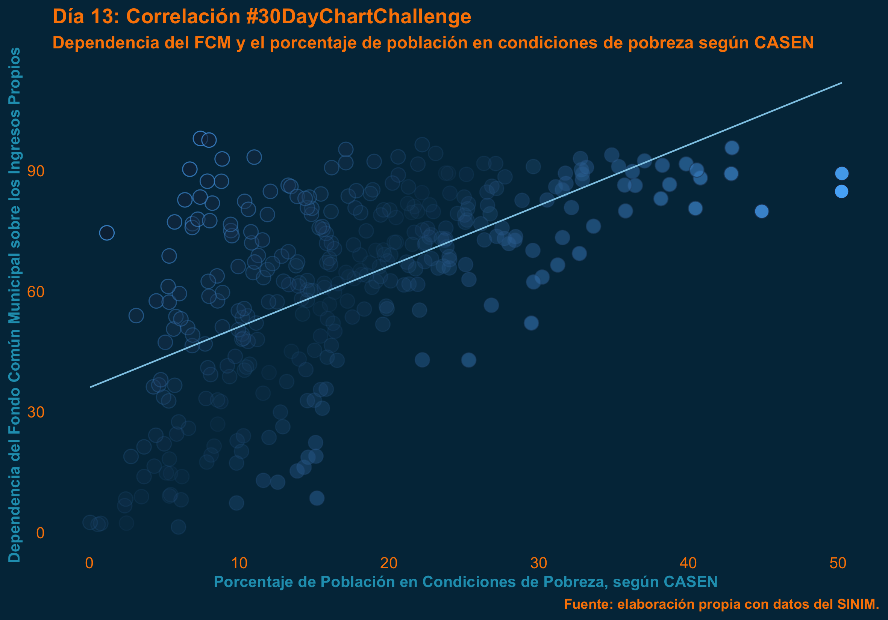
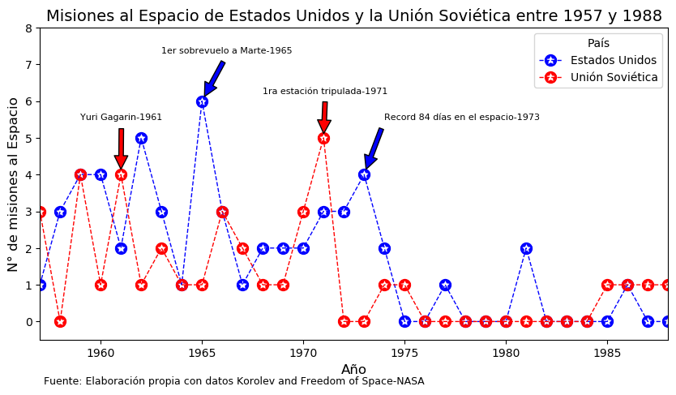
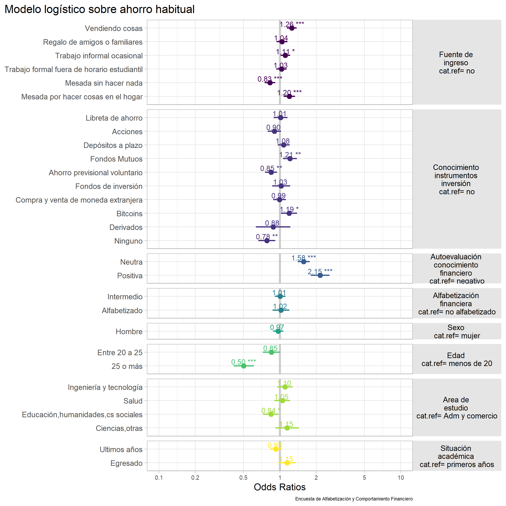
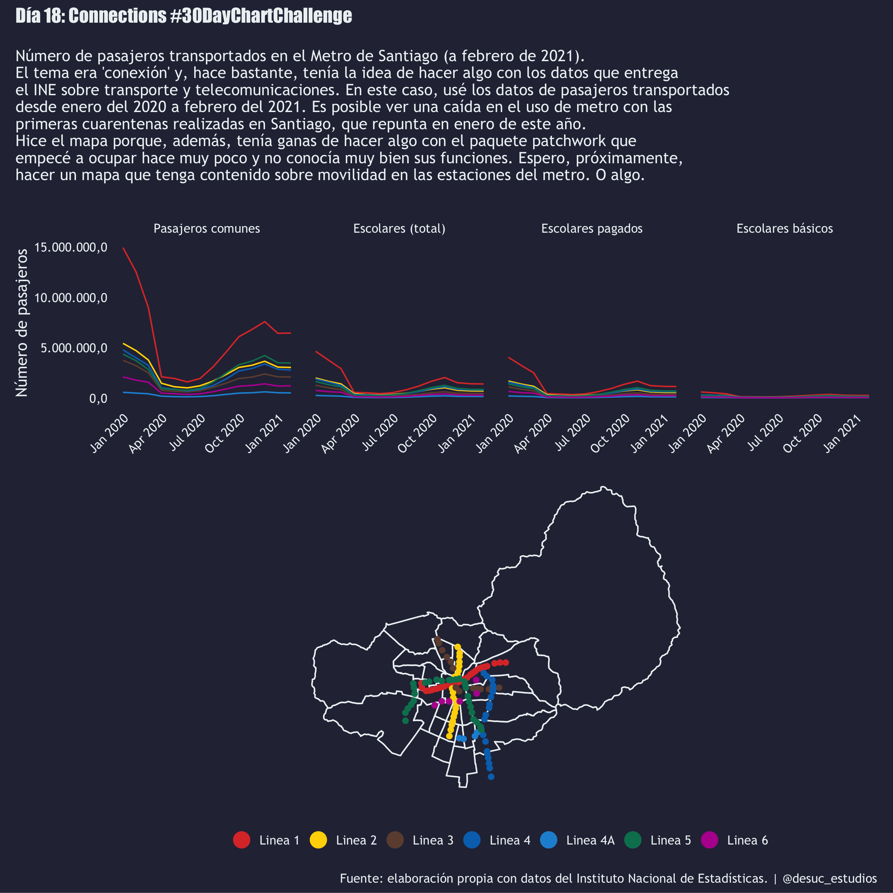

# 30DayChartChallenge2021
Participación en #30DayChartChallenge 2021.

- En la carpeta "R" encuentras los script de los gráficos subidos según día.

- En la carpeta "input" puedes encontrar las bases de datos, a menos que éstas sean públicas. De ser así en el script encontrarás un link a ellas.

- En la carpeta "output" encuentras las imágenes de los gráficos.

Equipo [DESUC](http://sociologia.uc.cl/desuc/quienes-somos-desuc/)

### Día 1: Part to whole 

- Datos para la elaboración del gráfico disponibles en la página web de [CNTV](https://www.cntv.cl/estudios-y-estadisticas/encuesta-nacional-de-television/)
- Código disponible [aquí](/R/01-part_to_whole.R)

### Día 2: Pictogram

- Datos para la elaboración del gráfico disponibles públicamente, ver script.
- Código disponible [aquí](/R/02-pictogram.R)

### Día 3: Historical

- Datos para la elaboración del gráfico disponibles públicamente, ver script.
- Código disponible [aquí](/R/03-historical.R)

### Día 4: Magical

- Datos para la elaboración del gráfico disponibles públicamente en paquete.
- Código disponible [aquí](/R/04-magical.R)

### Día 5: Slopes

- Datos para la elaboración del gráfico disponibles públicamente en paquete.
- Código disponible [aquí](/R/05-slopes.R)

### Día 6: Experimental

- Datos para la elaboración del gráfico a partir de informe de Pew Research Center 
[Measuring News Consumption in a Digital Era][06-pew]
- Código disponible [aquí](/R/06-experimental.R)

[06-pew]: https://www.journalism.org/2020/12/08/measuring-news-consumption-in-a-digital-era/

### Día 7: Physical

- Datos para la elaboración del gráfico a partir de la Encuesta realizada por Elige Vivir Sano y Universidad San Sebastián. Link en script.
- Código disponible [aquí](/R/07-physical.R)

### Día 8: Animals

- Datos para el gráfico a partir de nota [*Las curiosidades del Registro Nacional de Mascotas a dos años de su obligatoriedad*][08-subdere] de la Subsecretaría de Desarrollo Regional.
- Código disponible [aquí](/R/08-lollipop.R)

[08-subdere]: http://www.subdere.gov.cl/sala-de-prensa/las-curiosidades-del-registro-nacional-de-mascotas-dos-a%C3%B1os-de-su-obligatoriedad

### Día 10: Abstract

- Datos para el gráfico a partir de las métricas de Spotify*.
- Código disponible [aquí](/R/10-abstract.R)

### Día 13: Correlación

- Datos para el gráfico en script (con sinimr)
- Código disponible [aquí](/R/13-correlation.R)

### Día 14: Space

- Datos para el gráfico en script.
- Código disponible [aquí](/R/14-space.py)

### Día 15: Multivariate

- Datos para el gráfico en script.
- Código disponible [aquí](/R/15-multivariate.R)

### Día 18: Connections

- Datos de número de pasajeros transportados obtenidas desde el [INE](https://www.ine.cl/estadisticas/economia/transporte-y-comunicaciones/transporte-y-comunicaciones).
- Código disponible [aquí](/R/18-connections.R)

